# JobPilot — Architecture & Data Flow Design Document

**Source:** [JobPilot PRD v1.1 Definitive](file:///home/pranjal/ai-projects/job-pilot/relevant_docs/md/JobPilot_PRD_v1.1_Definitive.md)
**Date:** 2 April 2026

---

## 1. System Architecture Overview

The system comprises **9 autonomous agents** orchestrated by a **LangGraph state machine**, triggered by **APScheduler** cron jobs, and gated by **Telegram human-in-the-loop** checkpoints. All data is persisted to **PostgreSQL + pgvector** and the **local filesystem**. Metrics are exported to **Prometheus** and visualised in **Grafana**.

```mermaid
graph TB
    subgraph External["External Sources"]
        LI["LinkedIn"]
        NK["Naukri.com"]
        CP["200 Career Pages"]
        RSS["RSS/Atom Feeds"]
        Gmail["Gmail Inbox"]
        Apollo["Apollo.io"]
        Hunter["Hunter.io"]
    end

    subgraph Scheduler["APScheduler Triggers"]
        T10["Every 10 min"]
        T4H["Every 4 hrs"]
        T5M["Every 5 min"]
        T12H["Every 12 hrs<br/>(06:00 / 18:00)"]
        TDAILY["Daily 10 AM"]
        TNIGHTLY["Daily 9 PM"]
    end

    subgraph Agents["9 LangGraph Agent Nodes"]
        Scout["🔍 Scout Agent"]
        Resume["📄 Resume Agent"]
        App["📤 Application Agent"]
        Outreach["📨 Outreach Agent"]
        Tracker["📊 Tracker Agent"]
        EmailIntel["📧 Email Intelligence"]
        FollowUp["⏰ Follow-up Agent"]
        Adaptive["🧬 Adaptive Resume Engine"]
        Analytics["📈 Analytics (Metrics)"]
    end

    subgraph HumanLoop["Telegram HITL"]
        TG["🤖 Telegram Bot"]
        User["👤 Pranjal"]
    end

    subgraph DataStores["Data Persistence"]
        PG["PostgreSQL 17 + pgvector"]
        FS["Filesystem<br/>(resumes/, resume_versions/)"]
        Excel["tracker/job_pipeline.xlsx"]
        Prom["Prometheus TSDB"]
    end

    subgraph Infra["Infrastructure"]
        Grafana["Grafana Dashboards"]
        FastAPI["FastAPI /metrics"]
        Ollama["Ollama (local LLM)"]
    end

    T10 --> Scout
    T4H --> Scout
    T5M --> EmailIntel
    T12H --> Adaptive
    TDAILY --> FollowUp
    TNIGHTLY --> Tracker

    Scout --> TG
    Resume --> TG
    App --> TG
    Outreach --> TG
    FollowUp --> TG
    EmailIntel -.->|"high-priority alerts"| TG
    Adaptive -.->|"weekly report"| TG
    TG <--> User

    Scout --> PG
    Resume --> FS
    App --> PG
    Outreach --> PG
    Tracker --> Excel
    EmailIntel --> PG
    Adaptive --> FS

    LI --> Scout
    NK --> Scout
    CP --> Scout
    RSS --> Scout
    Gmail --> EmailIntel
    Apollo --> Outreach
    Hunter --> Outreach

    Analytics --> FastAPI
    FastAPI --> Prom
    Prom --> Grafana
```

---

## 2. Complete Inter-Agent Data Flow

This diagram traces every data handoff between agents, showing what data is produced, consumed, and where it's stored.

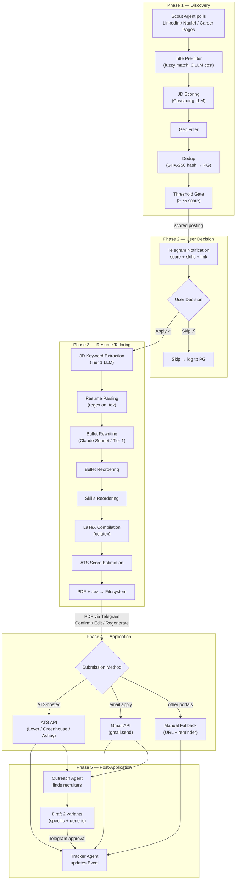

---

## 3. Cascading LLM Routing Strategy

Every LLM call in the system follows this waterfall. On failure at any tier, the request cascades to the next.

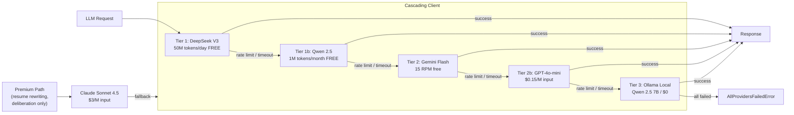

### LLM Routing by Task

| Task                        | Primary Route    | Fallback                |
| --------------------------- | ---------------- | ----------------------- |
| JD scoring                  | Cascade (Tier 1) | Full cascade            |
| JD keyword extraction       | Cascade (Tier 1) | Full cascade            |
| Bullet rewriting            | Claude Sonnet    | Cascade (lower quality) |
| Outreach drafts             | Cascade (Tier 1) | Full cascade            |
| Email classification        | Cascade (Tier 1) | Full cascade            |
| Follow-up drafting          | Cascade (Tier 1) | Full cascade            |
| Tournament: Keyword Agent   | Cascade (Tier 1) | Full cascade            |
| Tournament: Narrative Agent | Claude Sonnet    | Cascade (lower quality) |
| Tournament: Structure Agent | Cascade (Tier 1) | Full cascade            |
| Tournament: Market Agent    | Cascade (Tier 1) | Full cascade            |
| Tournament: Judge           | Cascade (Tier 1) | Full cascade            |
| Deliberation: Mediator      | Claude Sonnet    | Cascade (lower quality) |

---

## 4. Adaptive Resume Engine — Tournament & Feedback Loop

This is the architecturally most distinctive subsystem: a closed feedback loop that evolves the base resume every 12 hours based on actual acceptance/rejection data.

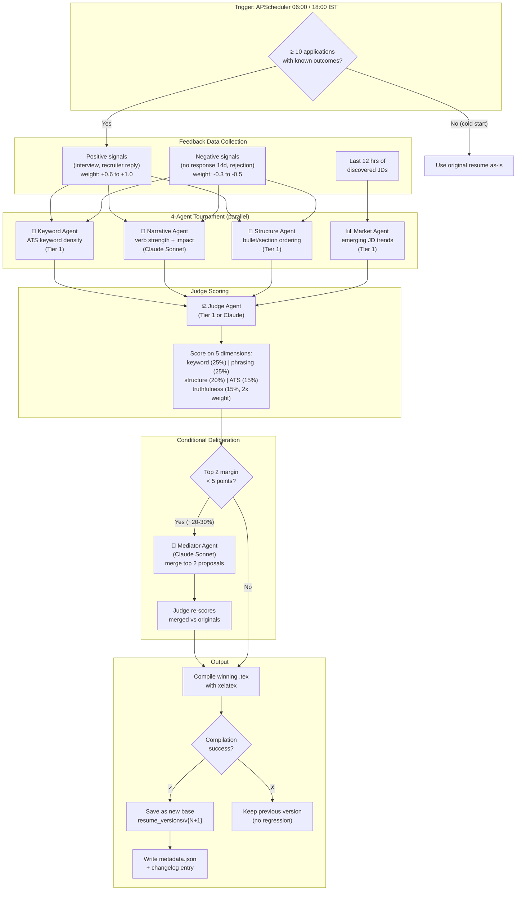

### The Closed Feedback Loop

```mermaid
flowchart LR
    BASE["Base Resume<br/>(resume_versions/current)"]
    TAILOR["Resume Agent<br/>tailors per JD"]
    SUBMIT["Application Agent<br/>submits"]
    RESPONSE["Email Intelligence<br/>classifies response"]
    FEEDBACK["Feedback Store<br/>(PostgreSQL)"]
    ENGINE["Adaptive Resume<br/>Engine (12hr cycle)"]

    BASE -->|"provides template"| TAILOR
    TAILOR -->|"tailored .tex/.pdf"| SUBMIT
    SUBMIT -->|"tracks outcome"| RESPONSE
    RESPONSE -->|"outcome + weight"| FEEDBACK
    FEEDBACK -->|"positive/negative signals"| ENGINE
    ENGINE -->|"improved version"| BASE

    style BASE fill:#4CAF50,color:#fff
    style ENGINE fill:#FF9800,color:#fff
```

---

## 5. Email Intelligence & Follow-up Data Flow

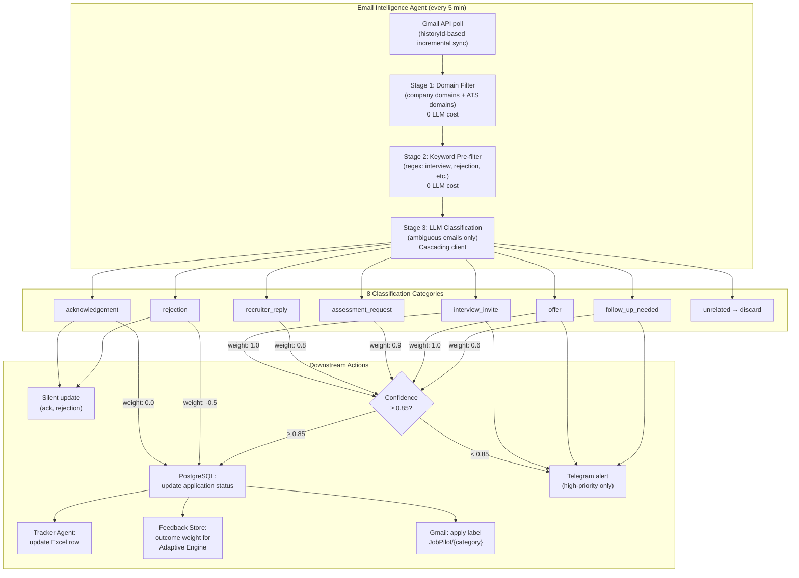

### Follow-up Agent

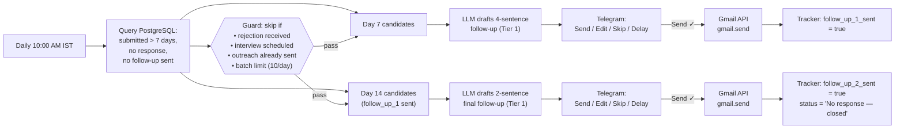

---

## 6. Outreach Agent Data Flow

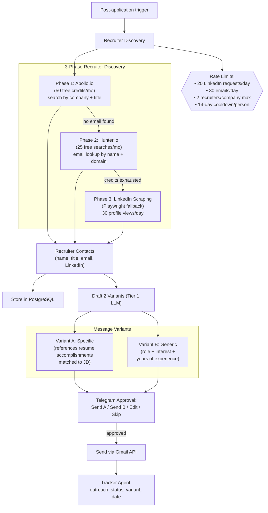

---

## 7. Data Store Topology

```mermaid
flowchart TD
    subgraph PG["PostgreSQL 17 + pgvector"]
        JOBS["jobs table<br/>posting metadata,<br/>JD text, scores"]
        APPS["applications table<br/>status, dates, methods,<br/>follow-up flags"]
        DEDUP["dedup_hashes<br/>SHA-256 index"]
        RESUMES_META["resumes_metadata<br/>ATS score, base version,<br/>keywords matched"]
        RECRUITERS["recruiters table<br/>contacts, outreach<br/>status, cooldowns"]
        EMAIL_LOG["email_classifications<br/>class, confidence,<br/>matched application"]
        FEEDBACK["feedback_store<br/>outcome weights,<br/>signals for engine"]
        EMBEDDINGS["pgvector embeddings<br/>resume/JD cosine<br/>similarity"]
        HISTORY_ID["gmail_sync_state<br/>historyId for<br/>incremental sync"]
        CHECKPOINTS["langgraph_checkpoints<br/>HITL state persistence"]
    end

    subgraph FS["Filesystem"]
        TAILORED["resumes/{company}/<br/>{role}_{date}.tex/.pdf<br/>+ metadata.json"]
        VERSIONS["resume_versions/<br/>v{N}_{timestamp}.tex/.pdf<br/>v{N}_meta.json<br/>changelog.md<br/>current → symlink"]
        TEMPLATES["templates/<br/>base_resume.tex<br/>cover_letter.tex"]
        DATA["data/<br/>harvard_action_verbs.yaml<br/>companies.yaml<br/>applicant_profile.yaml"]
        CREDS["credentials/<br/>gmail_oauth.json<br/>gmail_token.json"]
    end

    subgraph External_Stores["External"]
        EXCEL["tracker/<br/>job_pipeline.xlsx"]
        PROM["Prometheus TSDB<br/>(90-day retention)"]
    end

    Scout -->|"write"| JOBS
    Scout -->|"check"| DEDUP
    Scout -->|"embed"| EMBEDDINGS
    Resume_Agent["Resume Agent"] -->|"read"| VERSIONS
    Resume_Agent -->|"write"| TAILORED
    Resume_Agent -->|"write"| RESUMES_META
    App_Agent["Application Agent"] -->|"write"| APPS
    Outreach_Agent["Outreach Agent"] -->|"write"| RECRUITERS
    Email_Agent["Email Intelligence"] -->|"write"| EMAIL_LOG
    Email_Agent -->|"update"| APPS
    Email_Agent -->|"write"| FEEDBACK
    Email_Agent -->|"read/write"| HISTORY_ID
    FollowUp_Agent["Follow-up Agent"] -->|"read"| APPS
    FollowUp_Agent -->|"update"| APPS
    Adaptive_Engine["Adaptive Engine"] -->|"read"| FEEDBACK
    Adaptive_Engine -->|"write"| VERSIONS
    Tracker_Agent["Tracker Agent"] -->|"write"| EXCEL
    Analytics_Agent["Analytics"] -->|"write"| PROM
    Orchestrator["LangGraph Orchestrator"] -->|"read/write"| CHECKPOINTS
```

---

## 8. Human-in-the-Loop (HITL) Checkpoint Map

Every irreversible action in the system requires explicit user approval via Telegram. This diagram shows all HITL checkpoints and what happens at each.

```mermaid
flowchart TD
    subgraph Checkpoints["All HITL Checkpoints"]
        CP1["🔍 Job Notification<br/><b>Apply</b> / Skip / Details"]
        CP2["📄 Resume Review<br/><b>Confirm & Apply</b> / Edit / Regenerate"]
        CP3["📤 Application Confirm<br/><b>Confirm</b> / Cancel / View Resume"]
        CP4["📨 Outreach Approval<br/><b>Send A</b> / Send B / Edit / Skip"]
        CP5["⏰ Follow-up Approval<br/><b>Send</b> / Edit / Skip / Delay 3d"]
        CP6["📧 Low-confidence Email<br/><b>Verify</b> classification"]
    end

    CP1 -->|"Apply"| RESUME["Resume Agent starts"]
    CP1 -->|"Skip"| LOG1["Log skip → Tracker"]

    CP2 -->|"Confirm"| APPLY["Application Agent starts"]
    CP2 -->|"Edit"| EDIT["User sends edit instructions<br/>→ Resume Agent re-tailors"]
    CP2 -->|"Regenerate"| REGEN["Resume Agent re-runs<br/>from scratch"]

    CP3 -->|"Confirm"| SUBMIT["Submit via ATS/Email/Manual"]

    CP4 -->|"Send A/B"| OUTREACH["Send via Gmail API"]
    CP4 -->|"Edit"| EDIT_MSG["User edits → re-draft"]
    CP4 -->|"Skip"| LOG4["Log skip → Tracker"]

    CP5 -->|"Send"| FOLLOWUP["Send via Gmail API"]
    CP5 -->|"Delay"| DELAY["Reschedule +3 days"]
    CP5 -->|"Skip"| LOG5["Log skip → Tracker"]

    CP6 -->|"Confirm"| AUTO_UPDATE["Apply classification"]
    CP6 -->|"Override"| MANUAL["User provides correct class"]

    style CP1 fill:#2196F3,color:#fff
    style CP2 fill:#4CAF50,color:#fff
    style CP3 fill:#FF9800,color:#fff
    style CP4 fill:#9C27B0,color:#fff
    style CP5 fill:#F44336,color:#fff
    style CP6 fill:#607D8B,color:#fff
```

---

## 9. Monitoring & Observability

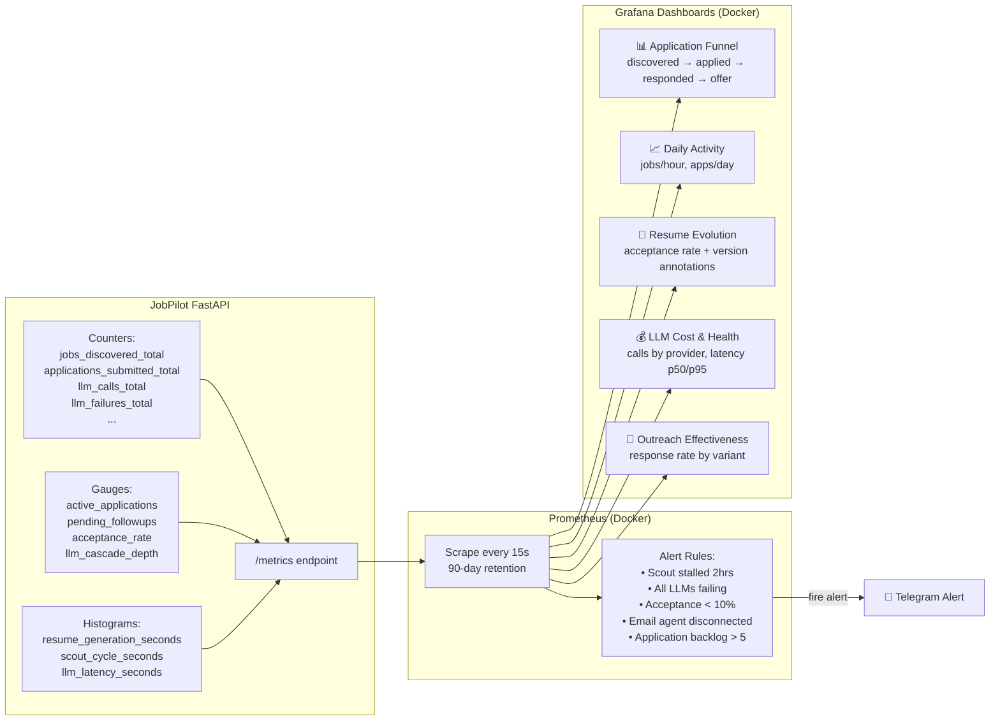

---

## 10. End-to-End Sequence — Happy Path

This shows the complete lifecycle of a single job posting from discovery to follow-up, with every agent interaction and data store touchpoint.

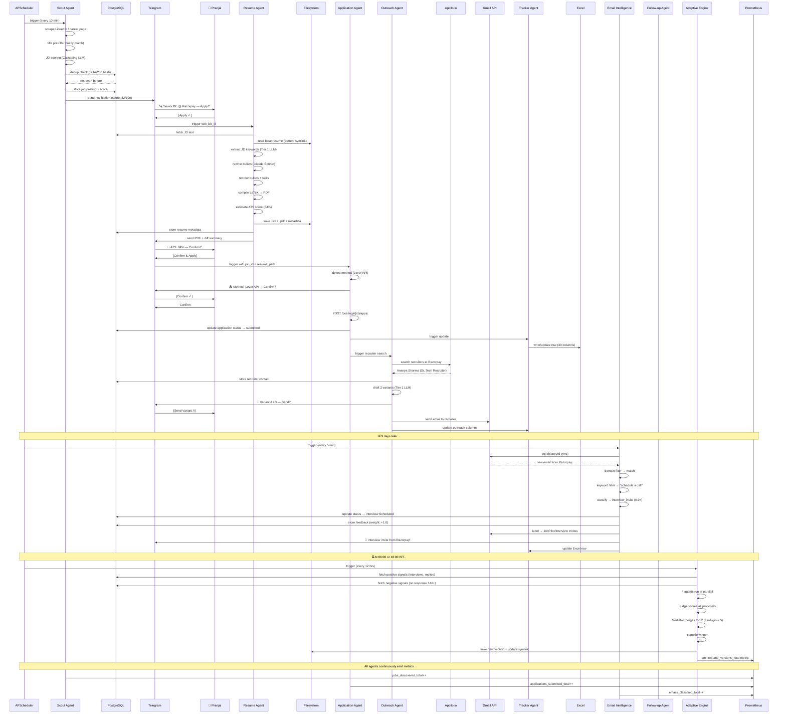

---

## 11. Scheduling Summary

| Trigger              | Frequency          | Agent(s)               | What Happens                              |
| -------------------- | ------------------ | ---------------------- | ----------------------------------------- |
| Scout Tier 1         | Every 10 min       | Scout                  | Poll top 30 companies + LinkedIn + Naukri |
| Scout Tier 2         | Every 4 hrs        | Scout                  | Poll remaining 170 companies              |
| Email poll           | Every 5 min        | Email Intelligence     | Gmail incremental sync + classify         |
| Resume evolution     | 06:00 + 18:00 IST  | Adaptive Resume Engine | 4-agent tournament → new base resume      |
| Follow-up check      | Daily 10:00 AM IST | Follow-up Agent        | Draft day-7 and day-14 follow-ups         |
| Daily summary        | Daily 9:00 PM IST  | Tracker Agent          | Pipeline stats → Telegram                 |
| Weekly resume report | Sunday 9:00 PM IST | Adaptive Resume Engine | Evolution summary → Telegram              |
| Prometheus scrape    | Every 15 sec       | Analytics (passive)    | `/metrics` scraped by Prometheus          |

---

## 12. Technology Deployment Map

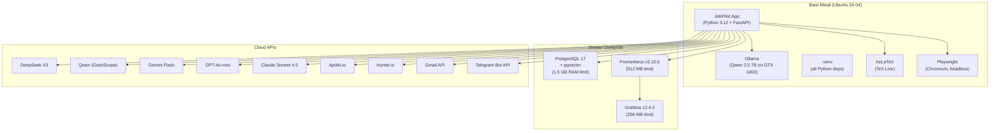

> [!NOTE]
> **RAM Budget (16 GB total):** PostgreSQL ~1.5 GB, Ollama ~4 GB (VRAM) + ~1 GB (RAM), Prometheus ~200 MB, Grafana ~200 MB, Playwright ~600 MB (2 contexts max), JobPilot app ~500 MB, OS + buffers ~8 GB. Fits within 16 GB with 8 GB swap as safety net.
