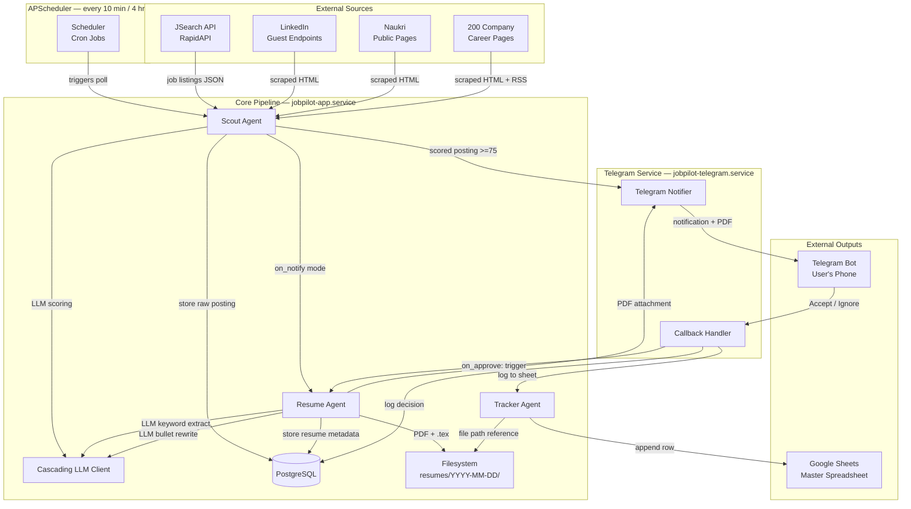
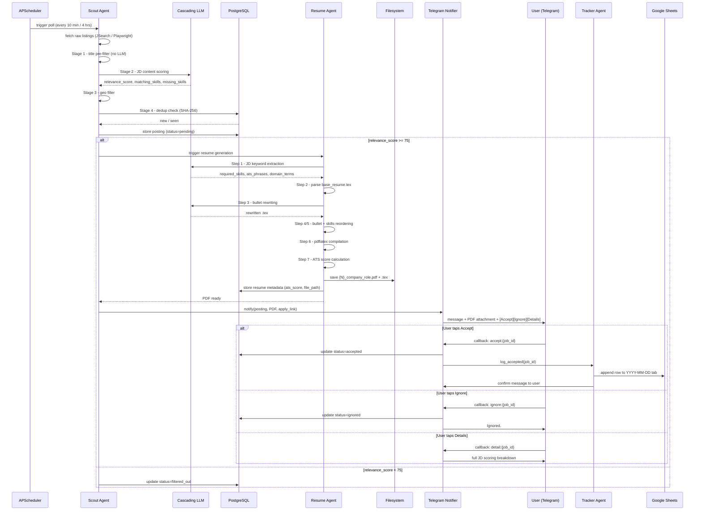
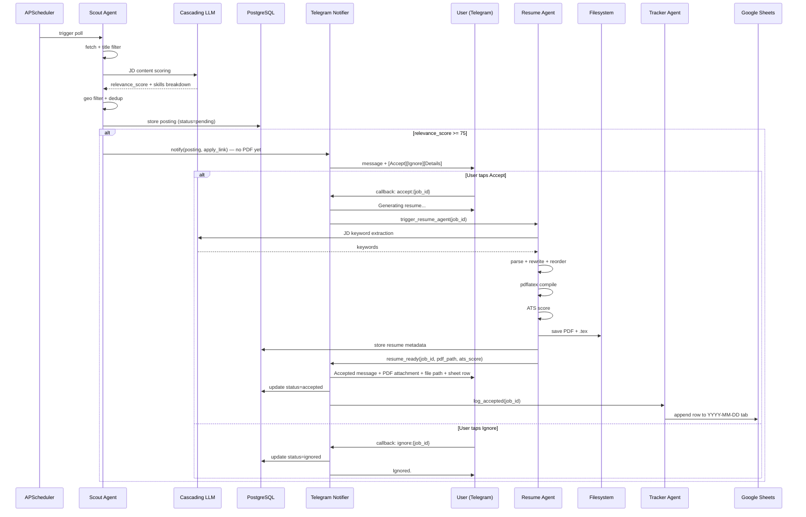
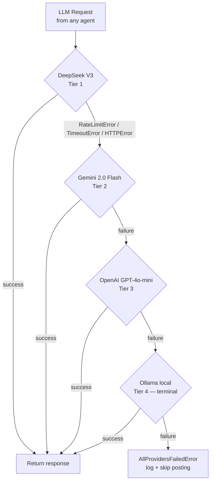
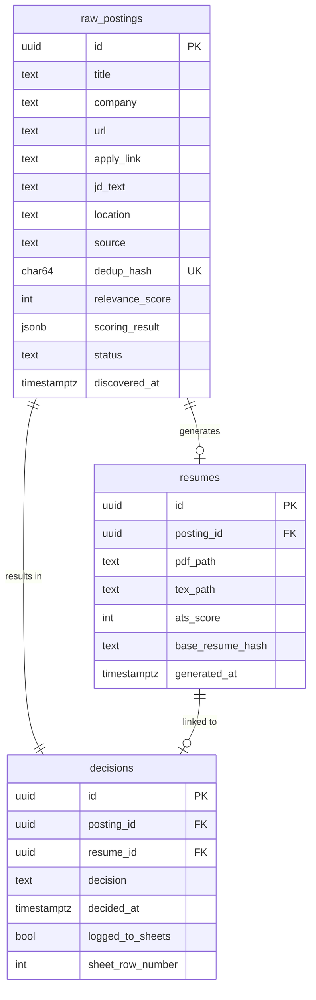
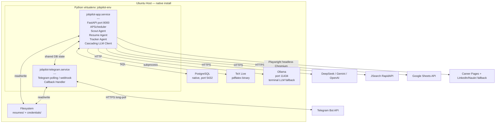

# JobPilot — Architecture Document v2.0

**Date:** 2 April 2026
**Based on:** PRD v2.0
**Scope:** Data flow, control flow, component interactions, persistence layer

---

## 1. System component map



---

## 2. Control flow — `on_notify` mode

Resume is generated **before** the user is notified. The PDF is attached to the first message.



---

## 3. Control flow — `on_approve` mode

Resume is generated **only after** the user taps Accept. The PDF is sent as a follow-up message.



---

## 4. Data flow — what moves where

```mermaid
flowchart LR
    subgraph Sources
        A1[JSearch API] -->|JSON: title, company, url, jd_text, location| B
        A2[LinkedIn Guest] -->|HTML parsed: same fields| B
        A3[Naukri Playwright] -->|HTML parsed: same fields| B
        A4[Career Pages] -->|HTML/RSS/JSON parsed: same fields| B
    end

    B[Scout Agent] -->|raw_posting: title, company, url, jd_text, location, source| C1[(PostgreSQL\nraw_postings)]
    B -->|jd_text + resume_text| D[Cascading LLM]
    D -->|scoring_result JSON| B
    B -->|filtered posting: id, title, company, url, apply_link,\nrelevance_score, matching_skills, missing_skills, location| E

    subgraph Resume ["Resume Agent (conditional)"]
        E -->|posting| F1[JD Keyword Extractor]
        F1 -->|keywords JSON| F2[LaTeX Parser]
        F2 -->|intermediate repr| F3[Bullet Rewriter]
        F3 -->|rewritten .tex| F4[pdflatex]
        F4 -->|compiled PDF| F5[ATS Scorer]
    end

    F5 -->|pdf_path, tex_path, ats_score| G[(PostgreSQL\nresumes)]
    F4 -->|PDF + .tex files| H[Filesystem\nresumes/YYYY-MM-DD/\nNN_company_role.*]

    E -->|posting metadata| I[Telegram Notifier]
    F5 -->|PDF binary + ats_score| I

    I -->|Telegram message:\ntitle, company, relevance,\nATS score, skills, apply_link,\nPDF attachment| J[User]

    J -->|callback: accept/ignore/detail| K[Callback Handler]

    K -->|job_id, decision, timestamp| L[(PostgreSQL\ndecisions)]
    K -->|on accept| M[Tracker Agent]

    M -->|row: date, company, role, url, location,\nrelevance, matching_skills, missing_skills,\nATS score, resume_path, decision, timestamp| N[Google Sheets\nYYYY-MM-DD tab]
```



---

## 5. LLM cascade — decision flow per call



**LLM call inventory — which agent calls the LLM for what:**

| Call | Agent | Task | Input tokens (est.) | Output tokens (est.) |
|------|-------|------|--------------------|--------------------|
| 1 | Scout | JD content scoring | ~3,000 (JD + resume) | ~300 (JSON) |
| 2 | Resume | JD keyword extraction | ~2,000 (JD) | ~200 (JSON) |
| 3 | Resume | Bullet rewriting | ~2,500 (bullets + keywords) | ~1,500 (rewritten) |

Total per posting that passes threshold: **~3 LLM calls, ~9,500 tokens**

---

## 6. PostgreSQL schema



---

## 7. Filesystem layout — runtime state

```
job-pilot/
│
├── data/
│   ├── base_resume.tex          <- user-provided, fixed base
│   ├── companies.yaml           <- 200-company list
│   └── harvard_verbs.yaml       <- action verb reference
│
├── resumes/                     <- generated output
│   ├── 2026-04-02/
│   │   ├── 01_razorpay_senior_backend_engineer.pdf
│   │   ├── 01_razorpay_senior_backend_engineer.tex
│   │   ├── 02_google_sre.pdf
│   │   └── 02_google_sre.tex
│   └── 2026-04-03/
│       └── ...
│
├── credentials/
│   └── google_service_account.json   <- chmod 600, gitignored
│
├── config.yaml
└── .env                         <- secrets, gitignored
```

**Naming convention:** `{row_number:02d}_{company_slug}_{role_slug}.{ext}`

Row number is assigned atomically when the posting passes the threshold gate and matches the Google Sheet row exactly.

---

## 8. Deployment topology



**systemd service summary:**

| Unit | Restart policy | Log command |
|------|---------------|-------------|
| `jobpilot-app.service` | `on-failure`, max 3 | `journalctl --user -u jobpilot-app` |
| `jobpilot-telegram.service` | `on-failure`, max 3 | `journalctl --user -u jobpilot-telegram` |
| `postgresql.service` | `always` | `journalctl -u postgresql` |
| `ollama.service` | `always` | `journalctl -u ollama` |

---

## 9. Data dictionary

| Field | Type | Producer | Consumer | Description |
|-------|------|----------|----------|-------------|
| `dedup_hash` | SHA-256 hex | Scout | Scout | `normalise(title+company+url)` — prevents duplicate notifications |
| `relevance_score` | int 0–100 | LLM via Scout | Scout, Telegram, Sheets | Composite JD–resume match score |
| `matching_skills` | string[] | LLM via Scout | Telegram, Sheets | Skills present in both JD and resume |
| `missing_skills` | string[] | LLM via Scout | Telegram, Sheets | Skills in JD not found in resume |
| `ats_score` | int 0–100 | Resume Agent | Telegram, Sheets | `(JD keywords in resume / total JD keywords) × 100` |
| `pdf_path` | string | Resume Agent | Telegram, Sheets, FS | Absolute path to compiled PDF |
| `sheet_row_number` | int | Tracker Agent | Filesystem naming | Row index in daily tab, 1-based. Prefixes resume filenames |
| `apply_link` | URL | Scout | Telegram | Direct URL to job application page |
| `decision` | enum | Callback Handler | Tracker, DB | `accepted` or `ignored` |
| `base_resume_hash` | SHA-256 hex | Resume Agent | Resume Agent | Hash of base_resume.tex at generation time — audit trail |

---

## 10. Error handling and resilience

| Failure | Detection | Recovery |
|---------|-----------|----------|
| All LLM tiers fail | `AllProvidersFailedError` | Log + skip posting; do not send Telegram notification |
| `pdflatex` compile error | Non-zero exit code | Auto-fix attempt (1 retry); if still failing, log and skip |
| JSearch quota at 190/200 | Request counter in DB | Auto-switch to Playwright fallbacks if enabled in config |
| Google Sheets API failure | HTTP error on append | Retry 3× with exponential backoff; log locally if persistent |
| Telegram send timeout | `python-telegram-bot` exception | Retry 3×; decision stored in DB regardless of Telegram state |
| PostgreSQL down | SQLAlchemy `OperationalError` | App service exits; systemd restarts (max 3 attempts, then alert) |
| Playwright blocked / CAPTCHA | Exception or empty result | Log + skip company for this cycle; continue with remaining companies |
